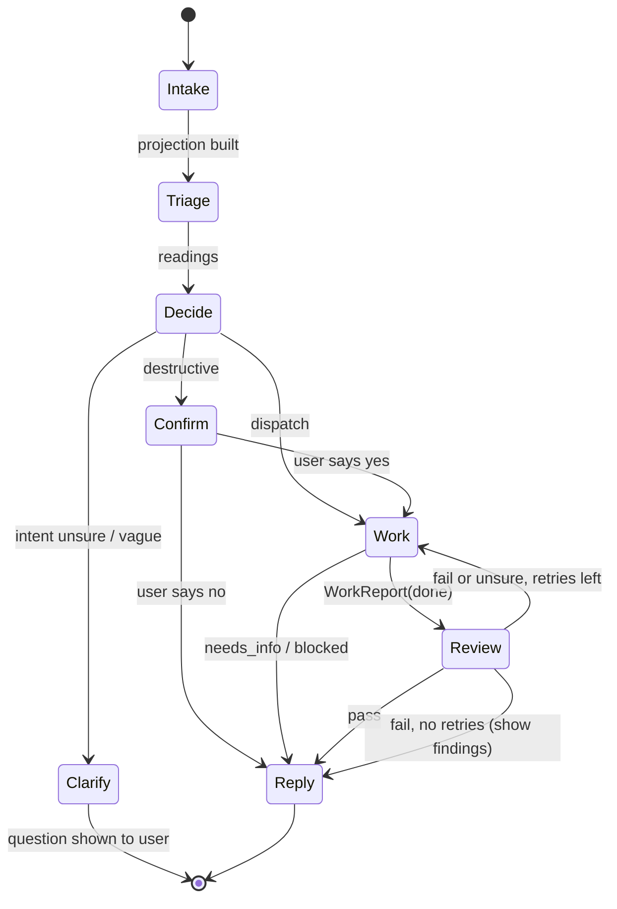

# Phase 1 — one turn: triage → dispatch → work → review

Status: design sketch, 2026-09-26. No code yet. Question wording and all thresholds are placeholders
to be calibrated on real prompts. Decisions this builds on are in `notes.md`.

## Goal

Start `magewind` in a folder and type a request. For every request the harness:

1. asks Jev a fixed set of questions about it (what kind of request, which tools, how hard, is it
   clear, is it risky),
2. turns the answers into a **dispatch** in plain code: model tier, toolset, instructions, budget,
3. runs one LLM worker with exactly that toolset until it reports back,
4. asks Jev a second set of questions about the result (did it do the task, did it stay in scope,
   does the summary match the diff),
5. replies, and records everything in the session's SQLite database.

**Out of scope for phase 1**: multiple workers or sagas, Jev checks on each tool call mid-run, the
markdown question language, a code index, the GUI, the Rust port.

## The turn as a state machine



Each box is a step over an immutable snapshot, `step(snapshot, event) -> (snapshot, effects)`, with
dataclasses for the snapshot and `match` on the phase. Effects (a Jev call, an LLM run, a tool call,
a database write) are carried out by a driver, which feeds the result back in as the next event.
That keeps every step testable without the network and makes a recorded session replayable.

Clarify ends the turn: the user's answer arrives as the next turn, and the triage state's
`previous_turn` carries the question that was asked, so no special "waiting" state is needed.

## Step 1 — Intake (code only)

- Insert a `turn` row.
- Pull **path candidates** out of the prompt with a regex (anything path-shaped or file-name-shaped)
  and keep the ones that exist under the working folder. This is TypeSafe's pre-parsed extraction
  pattern: code over-generates candidates, a Choice picks one with a "none" option
  ([cookbook](https://docs.typesafe.ai/cookbooks/pre_parsed_value_extraction_cookbook)).
- Build the triage state. Keep it small, because unrelated state lowers Jev's accuracy
  (project doc `jev-support-bot-design.md`, §2):

```json
{
  "request": "look in src/magewind for the agent loop and add a max-steps limit",
  "path_candidates": ["src/magewind", "src/magewind/agent.py"],
  "previous_turn": { "request": "...", "outcome": "done: explained agent.py" }
}
```

*Open*: whether to include a capped top-level listing of the folder. It helps `target` but adds text
Jev has to ignore. Try both against fixtures.

## Step 2 — Triage (one Jev call)

All questions go in one request. TypeSafe evaluates them in parallel, so asking questions that only
some branches need costs little ([speculative fan-out](https://docs.typesafe.ai/patterns/fan-out)).
Choice plus a Score for complexity is TypeSafe's own intent-routing pattern
([intent routing](https://docs.typesafe.ai/patterns/intent-routing)).

| Key | Kind | Draft wording / options |
| --- | --- | --- |
| `intent` | Choice | `ask`: answer a question about the project without changing anything · `find`: locate files, symbols or text · `change`: create, edit or delete files · `run`: run tests, a build or a script · `chat`: needs nothing from the project · `other`: none of these |
| `difficulty` | Score | 0 one lookup or one-line answer · 1 confined to one file · 2 several files, or investigation first · 3 cross-cutting, or needs design decisions |
| `needs_read` | Noul | Doing this requires reading file contents in the project. |
| `needs_search` | Noul | Doing this requires finding where something is in the project. |
| `needs_write` | Noul | Doing this requires creating or modifying files. |
| `needs_shell` | Noul | Doing this requires running a program or shell command. |
| `refers_back` | Noul | The request refers to something said or done earlier in the conversation. |
| `vague` | Noul | The request is too unclear to act on without first asking the user a question. |
| `destructive` | Noul | The request asks to delete, overwrite or discard work, or to act outside this folder. |
| `target` | Choice | one option per path candidate, plus `none` (asked only when candidates exist) |

Notes:

- Tool needs are **separate Nouls** because a Choice picks exactly one option
  ([Choice](https://docs.typesafe.ai/primitives/choice)) and a request can need several tools. This is
  my proposal; TypeSafe's docs have no multi-label pattern. Their skill-suggestion cookbook (a Choice
  to rank, then a Noul per shortlisted candidate) is the closest precedent and is the fallback if
  per-group Nouls prove noisy ([skill suggestion](https://docs.typesafe.ai/cookbooks/skill_suggestion)).
- Tool flags are per **group**, not per tool, so the question set stays fixed as tools are added.
- TypeSafe's page on coding agents positions Jev as a decision layer in an app, not as the coding
  model ([coding agents](https://docs.typesafe.ai/introduction/coding-agents)). Triage of coding
  requests is that kind of decision, but there is no published result for it. Calibrate on fixtures.

## Step 3 — Decide (code only, pure)

Each reading is first gated in its own kind into `act | unsure | skip` with bands from config (the
support-bot rule: no arithmetic across kinds). Then:

| Condition | Outcome |
| --- | --- |
| `intent` confidence below floor, or `vague` = act | **Clarify**: ask the user; the human is the cheapest source of new state |
| `destructive` = act or unsure | **Confirm** in the CLI before Work |
| `intent` = `chat` | **Work**, small tier, only `query_context` |
| otherwise | **Work** with the toolset and tier below |

**Toolset.** `query_context` is always present.

| Group | Tools | Granted when |
| --- | --- | --- |
| read | `list_dir`, `glob`, `read_file` | `needs_read` or `needs_search` not skip, or intent ∈ {ask, find, change} |
| search | `grep` | same as read |
| write | `edit_file`, `write_file` | intent = `change` at act **and** `needs_write` = act |
| shell | `run_command` | `needs_shell` = act, or intent = `run` at act; every command confirmed in the CLI |

**Uncertainty removes capability; it never adds it.** An unsure reading can grant read tools, never
write or shell. If the worker finds it needs more, it returns `needs_info` saying so and the next turn
re-triages.

**Tier.** `difficulty` score bands map to `small | medium | large`; low confidence on `difficulty`
moves up one tier. Model names live in config, not in the flow.

**Instructions.** Base worker prompt (`spec/prompts/worker.md`) + an intent addendum
(`spec/prompts/intents/<intent>.md`) + preference/style files + the chosen `target`. When
`refers_back` = act, add the last few turns' request and outcome; the worker can query more.

The result is a **dispatch**, written to the log as JSON before anything runs:

```json
{
  "turn": 7,
  "intent": {"choice": "change", "confidence": 0.91},
  "tier": "medium",
  "toolset": ["query_context", "list_dir", "glob", "read_file", "grep", "edit_file", "write_file"],
  "target": "src/magewind/agent.py",
  "instructions": ["spec/prompts/worker.md", "spec/prompts/intents/change.md", ".magewind/preferences.md"],
  "budget": {"requests": 20, "tool_calls": 40},
  "confirm": false
}
```

## Step 4 — Work (one LLM worker)

The installed `pydantic-ai` (2.48.0) accepts `model`, `instructions`, `deps`, `toolsets`,
`output_type` and `usage_limits` per `run()` call (checked in `pydantic_ai/agent/abstract.py`). So one
worker definition serves every dispatch: the dispatch picks the model, tools and instructions per
run.

**"Tell me when you're ready to be verified"** becomes the worker's output type. The run ends only
when the model returns a valid report:

```python
class WorkReport(BaseModel):
    status: Literal["done", "needs_info", "blocked"]
    summary: str
    files_changed: list[str]
    question: str | None = None   # what it needs, when status is needs_info
```

The harness does not trust `files_changed`. It computes the real diff itself and compares.

**Tools** are sandboxed to the working folder and all go through one wrapper that writes a
`tool_call` and `tool_result` event. The worker never writes to the context store.

| Tool | Behavior |
| --- | --- |
| `query_context(sql)` | read-only SQL over the session (below) |
| `list_dir(path)`, `glob(pattern)` | names only, capped |
| `grep(pattern, path?, glob?)` | ripgrep, capped matches with line numbers |
| `read_file(path, offset?, limit?)` | numbered lines, capped; the harness records the range read |
| `edit_file(path, old, new)` | exact-match replace, the style pi and Claude Code use |
| `write_file(path, content)` | new files or full rewrites |
| `run_command(cmd)` | confirmed by the user each time in phase 1, timeout, output capped |

Before the first write to any file the harness snapshots it, so it can produce the diff and undo.

## Step 5 — Review (one Jev call)

Runs when the report is `done`. State is the request, the intent, the worker's summary, the diff
(capped in code), and only the preference lines that apply.

| Intent | Questions (Noul) |
| --- | --- |
| change, run | `did_task`: the changes do what the request asked · `out_of_scope`: the changes include edits the request did not ask for · `summary_matches`: the summary accurately describes the diff · `follows_prefs`: the changes follow the listed preferences (only if there are any) |
| ask, find | `answered`: the reply answers the request · `grounded`: every claim is supported by the file excerpts provided (excerpts come from `file_read` rows) |
| chat | no review |

- All pass → Reply.
- Any fail or unsure → send the failing keys back to the same worker as one message, and run again.
  The retry counter is code (1 retry in phase 1). Still failing → reply with the work **and** the
  findings, so the user decides.
- A diff too large for Jev's request limit (32k tokens for state + longest question,
  [models](https://docs.typesafe.ai/models)) is itself a finding: "too big to review" goes to the user.
  This is the orchestrator's "too big" check from the framework notes.
- Counts and sizes (lines changed, files touched) are computed in code, never asked of Jev.

## Step 6 — Reply

Print the summary, files changed, and a one-line trace such as
`change 0.91 · medium · 7 tools · review pass`. `/trace` prints the full envelope for the last turn.

## The session store

**One SQLite file per session**, opened by the harness with the only read-write connection.

pi's SQLite session backend makes the same choice: one `.sqlite` file per session, with the host as
the single writer ([package](https://github.com/earendil-works/pi/tree/main/packages/session-backends/sqlite-node)).

*Open*: location. pi keeps sessions outside the project, one directory per working path
([pi sessions](https://github.com/earendil-works/pi/blob/main/packages/coding-agent/docs/sessions.md)).
The same here would be `~/.magewind/sessions/<encoded-cwd>/<session-id>.sqlite`, keeping repos clean.
The other option is `<project>/.magewind/`, gitignored.

Draft schema:

```sql
CREATE TABLE session (id TEXT PRIMARY KEY, started_at TEXT, cwd TEXT, version TEXT);

CREATE TABLE turn (
  id INTEGER PRIMARY KEY, seq INTEGER, parent_id INTEGER REFERENCES turn(id),  -- branching later
  request TEXT, status TEXT, started_at TEXT, ended_at TEXT
);

-- Append-only log: the source of truth. Everything else can be rebuilt from it.
CREATE TABLE event (
  id INTEGER PRIMARY KEY, turn_id INTEGER REFERENCES turn(id), seq INTEGER,
  kind TEXT,     -- intake | triage | dispatch | tool_call | tool_result | report | review | reply
  payload TEXT,  -- JSON
  at TEXT
);

-- One row per Jev answer, flattened so SQL can reach it.
CREATE TABLE reading (
  turn_id INTEGER, phase TEXT, key TEXT, kind TEXT,  -- phase: triage | review
  label TEXT, value REAL, confidence REAL,           -- choice label; score or noul value
  probabilities TEXT, model TEXT, state_hash TEXT
);

CREATE TABLE file_read   (turn_id INTEGER, path TEXT, start_line INTEGER, end_line INTEGER, sha TEXT);
CREATE TABLE file_change (turn_id INTEGER, path TEXT, before_sha TEXT, after_sha TEXT, diff TEXT);

-- What the worker is told about: views, so tables can change without breaking prompts.
CREATE VIEW history AS SELECT seq, request, status FROM turn ORDER BY seq;
```

**Read-only for agents, enforced by SQLite, not by the prompt.** `query_context` uses a separate
connection with four layers:

1. Opened with `file:<path>?mode=ro` and `uri=True`
   ([Python sqlite3](https://docs.python.org/3/library/sqlite3.html)).
2. An authorizer that allows only `SELECT`, `READ`, `FUNCTION` (and `RECURSIVE`, for `WITH
   RECURSIVE`) and denies everything else, including `ATTACH` and `PRAGMA`. SQLite's docs describe
   exactly this use: letting a user type arbitrary queries with an authorizer "that disallows
   everything except SELECT statements"
   ([sqlite3_set_authorizer](https://www.sqlite.org/c3ref/set_authorizer.html)). The same callback can
   hide columns by returning `SQLITE_IGNORE` if some context should stay out of a worker's reach.
3. A progress handler that aborts long queries (returning non-zero "will terminate the currently
   executing query").
4. A row cap and cell truncation on the result, with a "truncated" note so the agent can narrow the
   query.

`PRAGMA query_only` alone is not enough; SQLite says a database with it set "is not truly read-only"
([pragma docs](https://www.sqlite.org/pragma.html#pragma_query_only)).

**How this differs from recursive language models.** RLMs put the prompt in a REPL variable and let
the model write code to examine it and call itself on pieces
([Zhang, Kraska, Khattab 2025](https://arxiv.org/abs/2512.24601)). magewind keeps the "context lives
outside the prompt, the model pulls what it needs" idea but swaps code for SQL: declarative, no side
effects under the authorizer, and the same store the harness uses for replay and the console.
Recursive sub-calls are not part of phase 1.

## Proposed layout (Python)

The entry point `magewind = "magewind:main"` already exists in `pyproject.toml`.

```
python/src/magewind/
  __init__.py          main() -> cli.main()
  cli.py               argparse + REPL loop; slash commands /trace /history /quit
  turn.py              snapshot dataclasses + step(), match on phase
  triage.py            loads the triage question set, builds the projection
  decide.py            pure: readings -> Dispatch
  review.py            loads the review question set, gates the result
  evaluator/
    port.py            Evaluator protocol: evaluate(state, questions) -> readings
    jev.py             typesafe-sdk adapter, pinned model, records calls
    fake.py            keyword fake for tests and for running without a key
  worker/
    run.py             pydantic-ai wrapper: dispatch -> WorkReport
    report.py          WorkReport
  tools/
    registry.py        groups -> tools
    fs.py  search.py  shell.py  context.py
  store/
    schema.sql
    session.py         the only writer
    readonly.py        query_context connection
  config.py            tiers -> models, bands, paths
spec/
  questions/triage.json  review.json      question sets as data (TypeSafe wire format)
  prompts/worker.md  prompts/intents/*.md
  fixtures/triage/*.json                   prompt -> expected intent and flags
```

- Question sets in `spec/questions/` as JSON in TypeSafe's wire format (`{type, instructions,
  criteria}`, which is what `typesafe-sdk` 0.7.1's `Choice`/`Score`/`Noul` models serialize to). Same
  "edges are data" decision as the support bot, and the Rust port reads the same files.
- The existing `model.py` (`Message`, `ModelClient`) and `agent.py` (`Agent.step`) are superseded:
  `ModelClient` splits into the evaluator port and the worker wrapper. The fake-client test idea
  carries over as `evaluator/fake.py`.
- CLI: stdlib only to start. `argparse` for flags, `input()` for the prompt; importing `readline`
  gives `input()` line editing and history (libedit on macOS)
  ([readline](https://docs.python.org/3/library/readline.html)). `prompt_toolkit`/`rich` can come later.
- Pin the Jev model rather than using the SDK default `jev-latest` (currently `jev-1.13.0`,
  [models](https://docs.typesafe.ai/models)). The SDK's default timeout is 10 s.

## Build order

Each slice runs end to end before the next starts.

1. **REPL + store.** `magewind` opens a session, every prompt becomes a turn row, `/history` works.
2. **Triage only.** Evaluator port, fake, Jev adapter. Each prompt prints its readings and nothing
   else. Collect 30–50 real prompts into `spec/fixtures/triage/` and set bands from them. This is the
   "start a prompt, see the choice selection and tools" milestone.
3. **Decide.** Pure function tested against the fixtures; prints the dispatch.
4. **Read-only worker.** `ask`/`find` work end to end with read, search and `query_context`.
5. **Writes + review.** `edit_file`/`write_file`, harness-computed diffs, the review call, one retry.
6. **Shell.** `run_command` with per-command confirmation.

## Open questions

- Session file location (above).
- Which models back `small | medium | large`, and which provider. The repo has
  `pydantic-ai-slim[openai]` installed; the support bot used Claude Haiku.
- The intent labels. Six is a guess; fixtures will show which ones blur.
- Per-group tool Nouls vs. skill-suggestion-style Choice + verify.
- Where preference/style files live, and whether to read `AGENTS.md` for compatibility.
- Whether Clarify phrases its question from a template or a small LLM.
